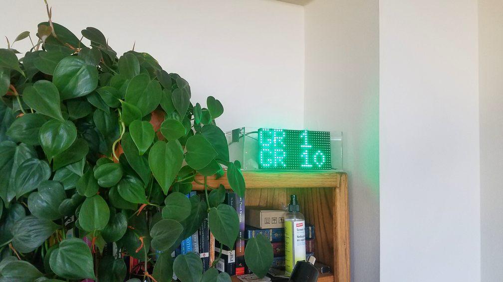

## Metro Countdown Clock

The clock currently displays times for Green and Yellow Line trains going south from U Street (in the direction of Branch Ave/Huntington), but can easily be adapted to display trains in any direction, from any station.

This project was inspired by [NextBus](https://github.com/cmoscardi/BigApps_2017), a NYC bus countdown clock. It takes the base code for the LED matrix and adapts it for use with DC's WMATA API. Special thanks to @cmoscardi for the idea!

The working clock:

